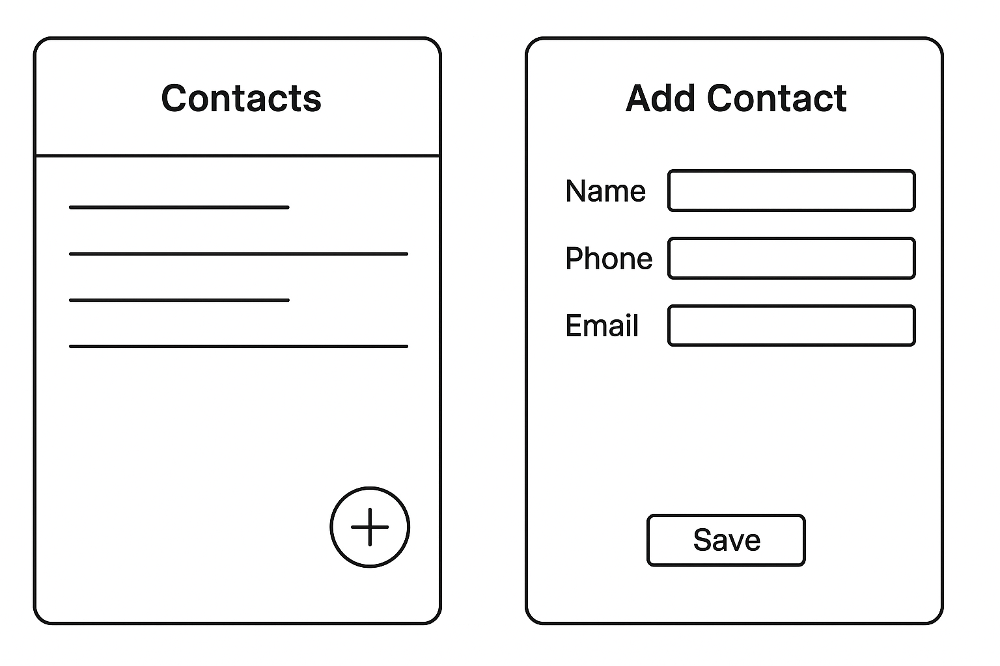

# Лабораторна робота №3
## Тема: Software Development Life Cycle (SDLC)

## Проєкт: Менеджер контактів

---

## 1. Планування

Мета продукту:  
Користувач повинен мати можливість зберігати контакти з іменем, номером телефону та електронною поштою, а також швидко знаходити потрібну людину.

---

## 2. Аналіз вимог (User Stories)

1. Як користувач, я хочу додавати новий контакт, щоб зберігати важливі номери. ✅ (Must have)
2. Як користувач, я хочу видаляти контакт, щоб прибирати неактуальні дані. ✅ (Must have)
3. Як користувач, я хочу редагувати контакт, щоб оновлювати інформацію.
4. Як користувач, я хочу переглядати список усіх контактів, щоб швидко знаходити людей.
5. Як користувач, я хочу зберігати e-mail разом з номером телефону, щоб мати всі дані в одному місці.

---

## 3. Дизайн (Прототип)

Прототип складається з двох екранів:

1. **Головний екран**
   - список контактів;
   - кнопка “+ Додати контакт”.

2. **Екран додавання контакту**
   - поле для імені;
   - поле для телефону;
   - поле для e-mail;
   - кнопка “Зберегти”.

---

## 4. Реалізація (Псевдокод)

function addContact(name, phone, email):
if name is empty or phone is empty:
return "Error: Name and phone are required"
else:
contact = createContact(name, phone, email)
contactList.add(contact)
return "Contact added successfully"

---

## 5. Тестування

1. Додати контакт “Іван”, телефон “0991234567” → контакт з’являється у списку.
2. Додати контакт без імені → система показує помилку.
3. Видалити контакт “Іван” → контакт зникає зі списку.

---

## 6. Висновок

Для цього проєкту найкраще підходить **Agile-модель SDLC**, оскільки додаток невеликий і може поступово розширюватися.
Agile дозволяє швидко додавати нові функції, наприклад пошук або групування контактів.
Waterfall є менш гнучким, а Spiral — надто складним для такого простого застосунку.
